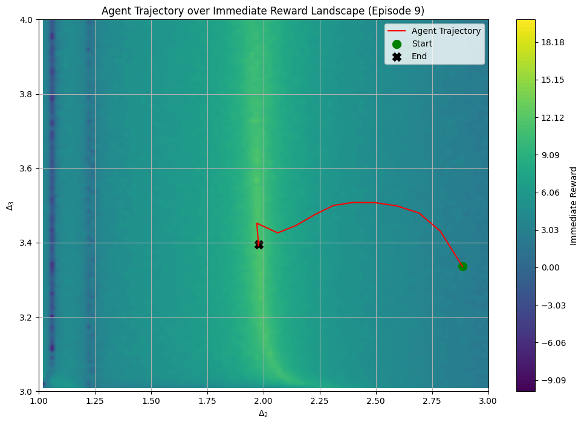

Reinforcement learning method for solving overconstrained systems of non-linear equations for conformal bootstrap. The agent explores the landscape of the equations in non-linear variables and makes a step towards the new variables which brings the system closed to being solvable. With GPU implementation of 2F1 hypergeomtetric function.

## Method
For more details:
[View the PDF](cft_rl.pdf)

An example path taken by an agent in a two variable case:

